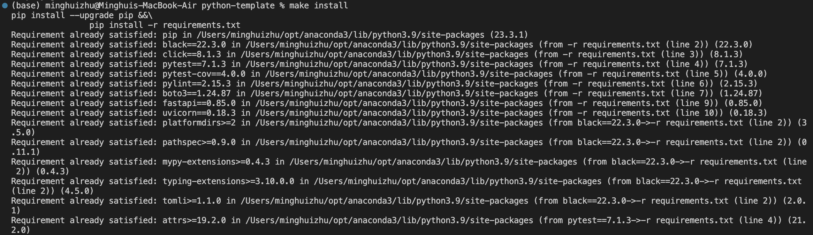
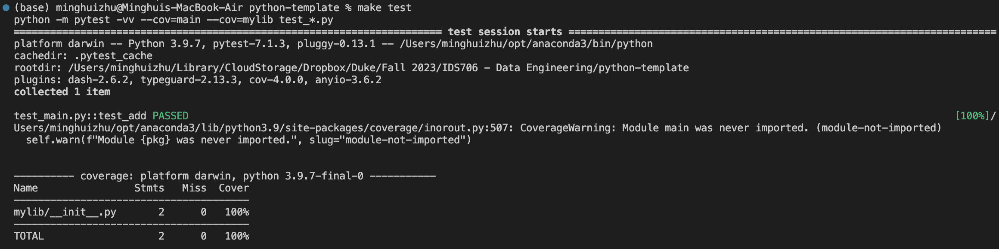
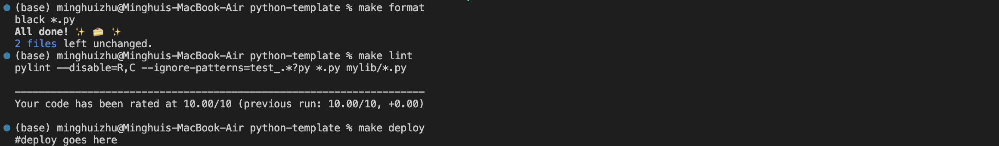
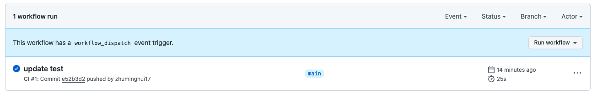

This is the Python template for IDS721 Data Engineering Systems.

This document provides an overview of the key components within the project repository.

### `.devcontainer`
- **`Dockerfile`**: Defines the container's build process and environment.
- **`devcontainer.json`**: Contains configuration settings for the development environment in VS Code.

### `workflows`
- Contains GitHub Actions workflows for automated build, test, and deployment pipelines.

### `.gitignore`
- Lists the files and directories that Git should ignore.

### `Makefile`
- Used for automating compilation, testing, and other development tasks on Unix-based systems.

### `README.md`
- Offers instructions and an introduction to the project.

### `main.py`
- The main Python script of the project.

### `requirements.txt`
- Specifies all necessary libraries and packages for the project.

### `test_main.py`
- Test script designed to validate the functionality of `main.py` within IDEs.

### `img`
- Stores screenshots or images of the project's execution results.

## Continuous Integration with GitHub Actions

The project uses GitHub Actions, employing the following commands:

- `make install`: Installs project dependencies.

- `make test`: Runs unit tests.

- `make format`: Formats the code according to the specified style.
- `make lint`: Checks the code for potential errors and style issues.

### CI Results

